# How to FIDO  <!-- omit in toc -->

_Employing FIDO authenticators and the WebAuthn API in your sign-in flows: A guide for relying parties_

## Let’s Define Some Terms  <!-- omit in toc -->

-  **Account Bootstrapping:** “*Bootstrapping* an account on a
     device”, or “bootstrap sign-in”.  
     Starting from scratch\[1\], a relying party authenticates a user.
     For example, this happens when a user puts their existing account
     on a newly-purchased phone. Or when a user logs into a website for
     the first time in a given browser instance. Or when a user logs
     into a website in a private browsing session (which doesn’t have
     cookies and other state from the main browsing session). Or when a
     user signs into a mobile app for the first time on a given device.
     Note that this is *different* from creating an account with a
     service in the first place.

-  **Reauthentication** happens when a relying party already knows
     who the user is, but would like to reconfirm this. For example,
     this happens before making sensitive changes to an account (add a
     recovery email address, change the passwords, etc.): a relying
     party would typically ask the user to re-enter their password or
     perform some other action to reconfirm their control of the
     session. Likewise, when a mobile app asks the user to sign in
     every time the app starts (or a web site asks the user to sign in
     again after a period of inactivity), this is technically a
     *reauthentication*, since the app or web site can choose to
     remember the user's authentication state after the account has
     been bootstrapped on the device, e.g., by setting cookies.

-  **Relying Party (RP):** The website that is trying to ascertain
     the identity of the user or perform FIDO authentication.

-  **Signing in:** This can refer to either account bootstrapping or
     reauthentication. When in doubt, we will use the latter, more
     descriptive, terms in the sections below.

-  **Logging in:** see *Signing in*.

-  **Login challenge**: A prompt served to the user that they need to
     *pass*. For example, a prompt asking the user for their password
     is a login challenge. A prompt asking the user to confirm sign-in
     on another device (e.g., their phone) is a login challenge. A
     prompt asking the user to insert and activate their *security key*
     is a login challenge. Account bootstrapping and reauthentication
     usually consist of serving the user one or more login challenges.

-  **Authentication factor:** Information provided by a user (or one
     of the user’s devices) for purposes of authentication, usually in
     response to a login challenge. Often categorized into "knowledge
     factors" (e.g. passwords), "something you have" factors (e.g.
     another already signed-in device), and "something you are" factors
     (e.g. biometrics). Note that a single login challenge may collect
     multiple factors simultaneously.

-  **2FA**: 2-factor authentication (aka **MFA**: multi-factor
     authentication). This refers to a contract between a user and a
     relying party where the relying party **must** collect at least
     two distinct authentication factors from the user during a
     bootstrap sign-in.

-  **2FA user**: a user whose account has 2FA turned on, i.e., who
     must present 2 authentication factors during sign-in.

-  **Roaming authenticator**: a FIDO authenticator usable with any
     device the user is trying to sign-in from. Roaming authenticators
     *attach* to users' devices in varying fashions. For example: via
     USB, NFC, or Bluetooth. These authenticators are often referred to
     as "Security Keys". A smartphone can also act as a roaming
     authenticator.

-  **Platform authenticator**: a FIDO authenticator that is
     *built-into* a user's device.

-  **UVRA:** **User-verifying roaming authenticator**. UVRAs can
     *verify*\[2\] individual users through the use of biometrics, or
     through the user typing a PIN or password, etc. An important class
     of UVRAs are *smartphones*, in which case the “attachment”
     typically happens over a wireless connection.

## Table of Contents  <!-- omit in toc -->

- [1 Overview](#1-overview)
- [2 Bootstrapping an Account](#2-bootstrapping-an-account)
  - [2.1 Authenticating the User](#21-authenticating-the-user)
  - [2.2 Opting into FIDO-based Reauthentication](#22-opting-into-fido-based-reauthentication)
- [3 Performing FIDO-based Reauthentication](#3-performing-fido-based-reauthentication)
- [4 Phishing-resistant 2nd Factors](#4-phishing-resistant-2nd-factors)
  - [4.1 Opting into FIDO-based 2FA](#41-opting-into-fido-based-2fa)
  - [4.2 Account Bootstrapping Using a FIDO 2nd-Factor](#42-account-bootstrapping-using-a-fido-2nd-factor)
- [5 User-Verifying Roaming Authenticators (UVRAs)](#5-user-verifying-roaming-authenticators-uvras)
  - [5.1 Registering a UVRA / Opting into FIDO-only Flows](#51-registering-a-uvra--opting-into-fido-only-flows)
  - [5.2 Registering a Phone as a UVRA](#52-registering-a-phone-as-a-uvra)
  - [5.3 Signing in with a UVRA](#53-signing-in-with-a-uvra)
- [6 Account Recovery / Device Loss](#6-account-recovery--device-loss)
- [7 Appendix: More Complex Use Cases](#7-appendix-more-complex-use-cases)
  - [7.1 Phishing-Resistant Account Bootstrapping with Optional Passwordless Sign-In](#71-phishing-resistant-account-bootstrapping-with-optional-passwordless-sign-in)

## 1 Overview

It’s important to understand that different types of authenticators
unlock different use cases and user experiences. The webauthn/FIDO APIs
support these different use cases, but relying parties must take care to
utilize the APIs correctly, e.g., by requesting the appropriate
transport or attachment type for the particular use case they are
addressing. If not done correctly, you risk confusing your users, making
authentication more complicated than necessary for them, or locking them
out of their account. 

### 1.1 Platform Authenticators and Roaming Authenticators

Platform authenticators have a unique issue which needs to be carefully considered when designing the flows and operations. 

**Issue:** Platform authenticators cannot be connected to and used with other devices. Namely, they cannot bootstrap other devices [16].

If a platform authenticator is the only authenticator that is registered and if there are no alternative credentials available for login, e.g., passwords, the user will be ‘locked-out’ from logging in the account if the platform authenticator is lost, stolen or damaged. If this situation happens, you need to invoke an account recovery process which typically causes frictions for users. To avoid the account recovery process, when allowing users to register a platform authenticator, you must be assured that users have alternative login methods such as (i) passwords, or (ii) additional roaming authenticators that have already been registered.  


It should be noted that passwords provided along with a platform authenticator allow anyone who knows the password to login. Therefore, it is vulnerable to phishing attacks even though it is adopting FIDO authenticators. On the other hand, additional roaming authenticators are phishing-resistant unlike passwords.

### 1.2 Use Cases

Below is an overview of the use cases unlocked by
the different types of authenticators:


<table>
<thead>
<tr class="header">
<th></th>
<th></th>
<th colspan="2">Physical manifestation of the authenticator</th>
<th></th>
</tr>
</thead>
<tbody>
<tr class="odd">
<td></td>
<td></td>
<td>Platform</td>
<td>Roaming</td>
</tr>
<tr class="even">
<td rowspan="2">Capabilities of authenticator</td>
<td>User-verifying</td>
<td><ul>
<li>
<p>convenient <em><strong>reauthentication</strong></em> UX[17]</p>
</li>
</ul></td>
<td><ul>
<li>
<p>phishing-resistant 2nd factor</p>
</li>
<li>
<p>phishing-resistant <em><strong>single-step account bootstrapping</strong></em>[3]</p>
</li>
</ul></td>
</tr>
<tr class="odd">
<td>Not-user-verifying</td>
<td><ul>
<li>
<p>defense-in-depth against malware[4]</p>
</li>
</ul></td>
<td><ul>
<li>
<p>phishing-resistant 2nd factor</p>
</li>
<li>
<p>low-security single-step account bootstrapping[5]</p>
</li>
</ul></td>
</tr>
</tbody>
</table>

Below we will get into more detail of how relying parties should
implement support for these different use cases, but we will approach
this from a user-journey perspective: what should you (as the relying
party) do during the login step, during the reauthentication step, etc.

## 2 Bootstrapping an Account

### 2.1 Authenticating the User

This section applies when the relying party doesn’t know yet who is
controlling the client device. There is no cookie, no credential id,
etc., available to the relying party, although for now we assume that
the user already has an existing account with the relying party.

To bootstrap an account on a device, serve the user a sign-in page.
Typically you would start off by asking the user for their account
identifier (username)\[6\]:

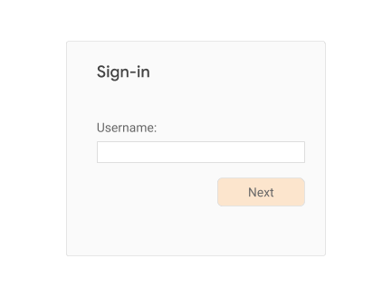

Once it’s clear who the user claims to be, appropriately serve further
login challenges to the user. This may or may not include asking the
user for their password, and may or may not include serving FIDO
challenges for 2FA users (see below for how to use FIDO for 2FA). This
may even include “account recovery” steps in case the user has forgotten
their password or is otherwise not able to pass the regular login
challenges. Once the user has passed all the login challenges, they’re
considered *authenticated* and *signed in*.

What happens when the user doesn’t already have an account with the
relying party? Usually, you will give users the option on the sign-in
page to create an account\[7\]. If the user chooses that option, collect
the necessary information from the user to open a new account. If the
user successfully opens a new account, they’re also considered
authenticated and sign-in.

Once the user is signed in (either because they bootstrapped their
account on the device by passing one or more login challenges, or
because they just created a new account at the relying party), make a
call to:

```javascript
PublicKeyCredential.isUserVerifyingPlatformAuthenticatorAvailable()
```

If that call returns true, then the user's system features a FIDO
platform authenticator, and you can offer the user the convenience of
using FIDO-based reauthentication in the future:

### 2.2 Opting into FIDO-based Reauthentication

Serve an opt-in page to the user offering biometric reauthentication:

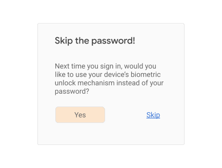

Consider showing (or linking to) longer descriptions explaining that all
users that are able to unlock the current device will be able to access
the account at the relying party to ensure that the user is giving fully
informed consent.

If the user consents, call `navigator.credentials.create()`, making sure
to ask for a platform authenticator and user verification:

```javascript
navigator.credentials.create({
  publicKey: {
    rp: {...},
    user: {...},
    challenge: ...,
    pubKeyCredParams: {
      type: "public-key",
      alg: -7
    },
    authenticatorSelection: {
      authenticatorAttachment: "platform", // !!!
      userVerification: "required"         // !!!
    },
  }
})
```

> A note on attestation: We recommend that most relying parties operating in the
> consumer (as opposed to enterprise) space not specify the attestation conveyance 
> parameter `attestation` (thus defaulting to none), or instead explicitly use the value 
> `indirect`. This guarantees the most streamlined user experience (platforms are likely 
> to obtain consent from the user for other types of attestation conveyances, which 
> likely results in a larger fraction of unsuccessful credential creations due to users 
> canceling the creation).

Associate the returned public key and credential id with the user
account. Also, make sure you associate the credential id **with the
device** the user just authenticated from. For example, store the
credential id in a cookie (or associate it with a cookie), or store the
credential id in local storage.

## 3 Performing FIDO-based Reauthentication

Reauthentication might happen for the following reasons:

  - The user signed out and now wants to sign in again.

  - The user session expired due to inactivity, and the user wants to
    sign in again.

  - The user is about to perform a sensitive action, and needs to
    re-confirm control over the user session.

Let’s look at the last case first: when it’s time to re-authenticate for
a sensitive action, check whether you have a credential id for this user
*for the purpose of reauthentication*, i.e., the kind of credential id
obtained from [<span class="underline">opting the user into FIDO-based
reauthentication</span>](#opting-into-fido-based-reauthentication). Make
sure it’s associated with the user *and* device - for example, check a
cookie or read from local storage.

If *no credential id is available*, serve a traditional login challenge
suitable for reauthentication\[8\], for example:


If, however, you *do* discover a credential id for the current session,
then you can use FIDO-based reauthentication:

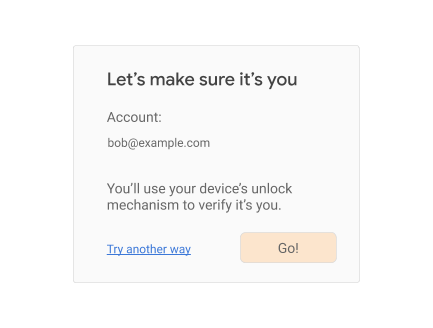

When the user is ready (in the above example, when they click on the
“Go\!” button), call `navigator.credentials.get()`, again requiring user
verification and specifying an “internal” transport:

```javascript
navigator.credentials.get({
  publicKey: {
    challenge: ...,
    rpId: ...,
    allowCredentials: [{
      type: “public-key”,
      id: ..., //!!! use the *one* credential id associated with  
               //!!! this user/device combination.
      transports: [“internal”]    //!!!
    }],
    userVerification: “required”, //!!!
  }
})
```

If the user instead clicks on “Try another way”, you should offer them
other login challenges (password, etc.) to reauthenticate them.

Now let’s look at the case where the reauthentication is triggered
because the user logged themselves out, or the relying party expired the
user session. To facilitate this, the relying party would have to keep
some form of secure user session state (unforgeable cookie, etc.) even
when they consider the user signed-out,\[9\] allowing it to give the
user a more convenient user experience. You, as the relying party, might
serve a sign-in page like this:

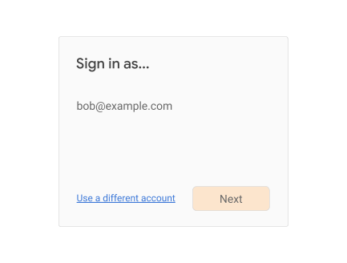

(An alternative UI treatment here could be an
[<span class="underline">account chooser-style
UI</span>](https://www.accountchooser.com/learnmore.html), especially
when the relying party allows multiple accounts to be signed-in at the
same time.)

If the user clicks on “Use a different account”, then you should enter
an account bootstrap flow as explained above, repeating the steps in
[<span class="underline">Authenticating the
User</span>](#authenticating-the-user) and
[<span class="underline">Opting into FIDO-based
Reauthentication</span>](#opting-into-fido-based-reauthentication),
presumably with a different account. In this case, you should also give
the user the ability to completely remove their account from being
listed on the sign-in page.

If the user clicks on “Next”, then check whether you have a credential
id associated with the user and device (for example, check a cookie or
read from local storage). If no credential id is available, serve a
traditional login challenge suitable for reauthentication, for example:

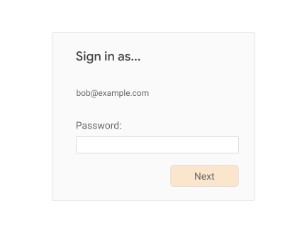

If, however, you *do* find a credential id for the current session, then
you can use FIDO-based reauthentication:

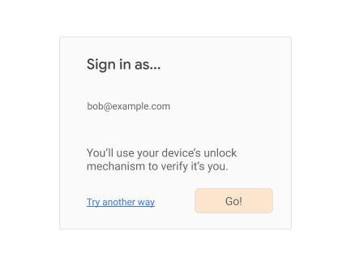

When the user is ready (in the above example, when they click on the
“Go\!” button), call navigator.credentials.get(), again requiring user
verification and specifying an “internal” transport:

```javascript
navigator.credentials.get({
  publicKey: {
    challenge: ...,
    rpId: ...,
    allowCredentials: [{
      type: “public-key”,
      id: ..., //!!! use the *one* credential id associated with  
               //!!! this user/device combination.
      transports: [“internal”]    //!!!
    }],
    userVerification: “required”, //!!!
  }
})
```

If the user instead clicks on “Try another way”, you should offer them
other login challenges (password, etc.) to reauthenticate them.
   

## 4 Phishing-resistant 2nd Factors

The login flows shown above don’t fundamentally change the security
posture of your user accounts. If, for example, your account bootstrap
flow consists of asking the user for only a username and password, then
opting them into FIDO-based reauthentication (as shown above), still
leaves the user vulnerable to phishing attacks. Using user-verifying
platform authenticators for reauthentication is simply a way to make
reauthentication easier to use, it’s not a way to make the account
resistant to phishing attacks.

To actually reduce the exposure of your users to certain phishing risks,
you can offer them the ability to use FIDO-based roaming authenticators
as 2nd factors when bootstrapping their account.\[10\]

> **Note:** We <strong><span class="underline">do not recommend</span></strong> 
> allowing users to register user-verifying platform authenticators as second factors for 
> account bootstrapping. If you want to give your users the convenience of biometric 
> sign-in, follow <a href="#opting-into-fido-based-reauthentication"><span class="underline">the
> steps above</span></a> to register a user-verifying platform authenticator as a password
> replacement for **reauthentication**, **not** as a second factor
> for account bootstrapping.<br />
> <br />
> This is ok to do even for your 2FA users, who might expect two different login challenges 
> for a sign-in-after-sign-out reauthentication: the platform authenticator represents something
> the user *has*, and it will verify something the user *knows* (PIN) or 
> *is* (biometric).

### 4.1 Opting into FIDO-based 2FA

Have your users register their roaming authenticators on a page that
they normally use for security purposes such as 2FA sign-up, password
changes, etc. In particular, we do **not** **recommend** in-lining this
opt-in choice as part of the user’s sign-in flow, *unless* your site
makes 2FA mandatory\[11\].

Typically, you would have a page like this:

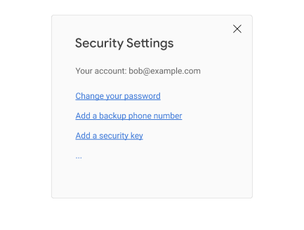

When the user clicks on “Add a security key”, you call
`navigator.credentials.create()`, taking care to specify “cross-platform”
for the attachment type. You should also look up any existing credential
ids for 2FA authenticators already registered for the current user (you
can ignore credential ids for platform authenticators), and specify
those in the exclude-list, thus ensuring that a user doesn’t register
the same authenticator twice:

```javascript
navigator.credentials.create({
  publicKey: {
    rp: {...},
    user: {...},
    challenge: ...,
    pubKeyCredParams: {
      type: "public-key",
      alg: -7
    },
    excludeCredentials: [{ //!!! Credentials already on file for
      type: "public-key",  //    this user. These are just examples.
      id: new UInt8Array([21, 31, 56, ...]).buffer,
      transports: ["usb", "nfc"]
    }, {
      type: "public-key",
      id: new UInt8Array([21, 31, 56, ...]).buffer,
      transports: ["internal", "ble"]
    }, {
     ...
    }],
    authenticatorSelection: {
      authenticatorAttachment: "cross-platform", //!!!
      // for the 2FA case, leave userVerification unspecified
    },
  }
})
```

> A note on attestation: We recommend that most relying parties not specify the attestation 
> conveyance parameter attestation (thus defaulting to none), or instead explicitly use the value 
> indirect. This guarantees the most streamlined user experience (platforms are likely to obtain 
> consent from the user for other types of attestation conveyances, which likely results in a 
> larger fraction of unsuccessful credential creations due to users canceling the creation).

It is common practice to let the user name the authenticator (either
before or after you call `create()`), and to show the user a list of
registered authenticators on this page, or a related accounts settings
page, where they can deregister individual authenticators.

### 4.2 Account Bootstrapping Using a FIDO 2nd-Factor

Once they register a roaming authenticator, users can now secure their
bootstrap sign-ins by using this authenticator as a 2nd-factor during
sign-in.\[12\]

The relying party starts the bootstrap sign-in flow as usual, typically
by asking the user for their account identifier (username)\[13\]:


Once it’s clear who the user is, serve appropriate login challenges to
the user. Typically this will include asking the user for a password,
but it might not. At some point (perhaps directly after collecting the
password), you serve a login challenge for the FIDO 2nd-factor:

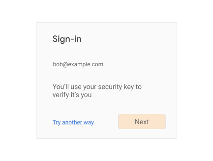

When the user clicks on “Next”, call `navigator.credentials.get()`,
specifying all the credential ids you have on file for this user's
roaming 2FA authenticators:

```javascript
navigator.credentials.get({
  publicKey: {
    challenge: ...,
    rpId: ...,
    allowCredentials: [{ //!!! make sure you specify these
      type: "public-key",
      id: new UInt8Array([21, 31, 56, ...]).buffer,
      transports: ["usb", "nfc"]
    }, {
      type: "public-key",
      id: new UInt8Array([21, 31, 56, ...]).buffer,
      transports: ["internal", "ble"]
    }, {
    ...
    }],
    //!!! no need to specify userVerification parameter
  }
})
```

Note that the browser or platform OS will prompt the user at this point
to use their security key. Here is an example of what this might look
like in Chrome on Linux:

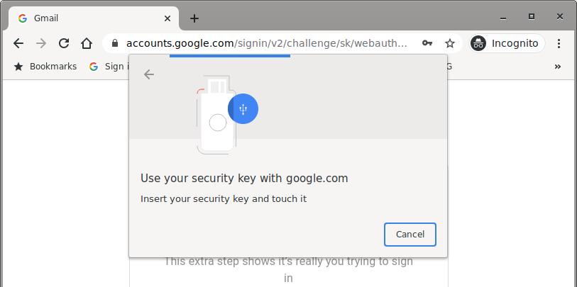

Upon touching their authenticator, you will receive a
PublicKeyCredential object containing a
[<span class="underline">AuthenticatorAssertionResponse</span>](https://www.w3.org/TR/webauthn/#authenticatorassertionresponse)
**which you need to successfully
[<span class="underline">verify</span>](https://www.w3.org/TR/webauthn/#verifying-assertion)**
before considering the user authenticated and signed-in.

## 5 User-Verifying Roaming Authenticators (UVRAs)

Note that in what we’ve discussed so far, the user would have to use
another authentication method - such as a password - to bootstrap the
account on a device before they can opt into FIDO-based
reauthentication; and they also would typically use another
authentication method - such as a password - in conjunction with a
roaming FIDO authenticator to implement phishing-resistant 2FA.  
  
**User-verifying roaming authenticators** (**UVRA**) unlock truly
FIDO-only/passwordless use cases, such as *single-step account
bootstrapping*. A UVRA inherently meets the 2FA security bar, since it
represents something the user *has* (the authenticator), and it will
also verify something the user *knows* or *is* (PIN or biometric). In
fact, like any type of FIDO authentication, UVRAs provide phishing
resistance, thus exceeding the security level of many other forms of
2FA. Login flows built around UVRAs are therefore suitable not just for
the general population, but even for high-security users such as 2FA
users.

Yet, the user experience is that of a single-step sign-in: the user
simply uses the authenticator to bootstrap their account on another
device, without needing to also provide a password or passing other
login challenges on that device\[14\].

### 5.1 Registering a UVRA / Opting into FIDO-only Flows

> Note that one important class of UVRAs are mobile phones, which we’ll
> handle in more detail below. This section deals with other forms of
> UVRAs (such as special-purpose hardware tokens with PIN protection or a
> fingerprint scanner), or with relying parties that don’t wish to take
> advantage of the more streamlined user experience that are possible when
> using a phone as a UVRA.

Users need to set up their UVRA so it can be used in a
FIDO-only/passwordless login flow. We recommend that relying parties do
this *outside* of the normal login flow, unless the relying party
*knows* that the user is in possession of a UVRA device (in which case
registering the UVRA can be done as part of the login flow). For most
consumer use cases, the relying party won’t know whether the user
possesses a UVRA, and therefore should promote the use of UVRAs to users
outside of the login flow. For the purpose of this guide, we assume that
the relying party has somehow advertised its support of UVRAs, and is
suggesting that users possessing a UVRA device go to a registration page
that might look like this:

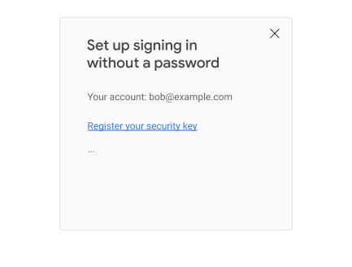

When the user clicks on “Register your security key”, you call
`navigator.credentials.create()`, taking care to specify “cross-platform”
for the attachment type, requiring user verification, and requiring a
resident (aka discoverable) key\[15\]. You also want to look up any
existing credential ids for UVRAs already registered for the current
user (you can ignore credential ids for platform authenticators and 2FA
authenticators), and specify those in the exclude-list, thus making sure
that a user doesn’t register the same authenticator twice:

```javascript
navigator.credentials.create({
  publicKey: {
    rp: {...},
    user: {...},
    challenge: ...,
    pubKeyCredParams: {
      type: "public-key",
      alg: -7
    },
    excludeCredentials: [{ //!!! UVRAs already on file for
      type: "public-key",  //    this user. These are examples.
      id: new UInt8Array([21, 31, 56, ...]).buffer,
      transports: ["usb", "nfc"]
    }, {
      type: "public-key",
      id: new UInt8Array([21, 31, 56, ...]).buffer,
      transports: ["internal", "ble"]
    }, {
     ...
    }],
    authenticatorSelection: {
      authenticatorAttachment: "cross-platform", //!!!
      requireResidentKey: true,                  //!!!
      userVerification: "required"               //!!!
    },
  }
})
```

> A note on attestation: We recommend that most relying parties not specify the attestation 
> conveyance parameter `attestation` (thus defaulting to none), or instead explicitly use 
> the value `indirect`. This guarantees the most streamlined user experience (platforms are 
> likely to obtain consent from the user for other types of attestation conveyances, which 
> likely results in a larger fraction of unsuccessful credential creations due to users 
> canceling the creation).

You should let the user name the authenticator (either before or after
you call create()), and show the user a list of UVRAs that they have
registered on this or a related accounts settings page.

### 5.2 Registering a Phone as a UVRA

Technically speaking, phones can be registered the same way as other
UVRAs. The browser or platform that is providing the webauthn API will
typically provide a way for the phone and browser to directly connect
wirelessly, so that a FIDO credential can be generated as just
described.

There is, however, a better way: relying parties have the opportunity to
register the phone as a UVRA if and when the user is interacting with a
mobile app belonging to the relying party, or by visiting the relying
party’s website on the phone. We call this *on-device registration*.

On-device registration for using the phone as a UVRA is very similar to
opting the user into FIDO-based reauthentication on the phone. In fact,
we recommend that the relying party re-use the same moment - during
**account bootstrapping** of the account on the phone and after
checking that a user-verifying platform authenticator exists - to opt
the user both into FIDO-based reauthentication on the phone, **and**
into using the phone as a UVRA:

We recall the recommended steps during an account bootstrap. First,
after the user is authenticated, make a call to

```javascript
PublicKeyCredential.isUserVerifyingPlatformAuthenticatorAvailable()
```

If that call returns true, you can prompt the user to opt into
FIDO-based reauthentication. If the user is on a platform that can be
used as a UVRA, you can also tell them about passwordless functionality:

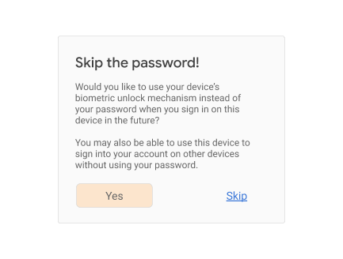

Consider showing (or linking to) longer descriptions explaining that all
users that are able to unlock the current device will be able to access
the account (and to bootstrap it on new devices), in order to ensure
that the user is giving informed consent.

> **Note:** One issue here is that you won’t know whether the underlying platform supports
> UVRA functionality (i.e., if it’s really a mobile phone) until you receive the registration 
> response and inspect the indicated transports, especially since browsers are moving to a 
> model where user-agent strings are becoming less and less revealing about the user’s 
> device type. We therefore recommend using language like shown above implying that this 
> UVRA functionality may or may not work.

If the user consents, call navigator.credentials.create(), making sure
to ask for a platform authenticator, user verification, and a resident
(discoverable) key:

```javascript
navigator.credentials.create({
  publicKey: {
    rp: {...},
    user: {...},
    challenge: ...,
    pubKeyCredParams: {
      type: "public-key",
      alg: -7
    },
    authenticatorSelection: {
      authenticatorAttachment: "platform", //!!!  
      requireResidentKey: true,            //!!!
      userVerification: "required"         //!!!
    },
  }
})
```

> A note on attestation: We recommend that most relying parties not specify the attestation 
> conveyance parameter `attestation` (thus defaulting to none), or instead explicitly use the 
> value `indirect`. This guarantees the most streamlined user experience (platforms are likely 
> to obtain consent from the user for other types of attestation conveyances, which likely 
> results in a larger fraction of unsuccessful credential creations due to users canceling the 
> creation).

If the transports indicated in the response include "ble" and/or
"cable", you know that the present device can be used as a UVRA.
Register the returned credential id both as a credential id for
reauthentication as well as a UVRA for this user. You might want to tell
the user about this:

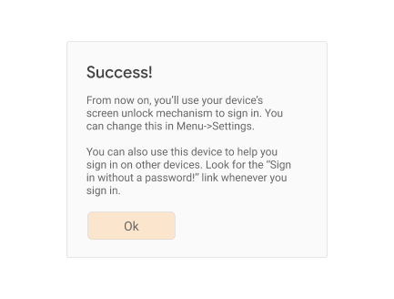

If the transports indicated in the response only include “internal”, but
not “ble” and/or “cable”, the user can still use this platform
authenticator for FIDO-based reauthentication on this phone, but will
have to use other mechanisms to bootstrap their account on other
devices. You might want to inform the user about this:

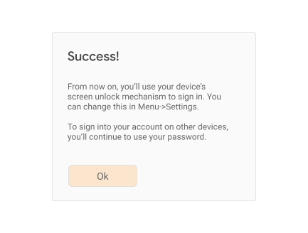

If the response indicates that the device cannot be used as a UVRA,
register the returned credential id just as a credential id for
reauthentication.

If the user registers their phone as a UVRA this way, consider creating
a page in your account settings that shows the user a list of their
registered UVRAs, and allow for deregistering them. There is no need to
let the user name their UVRA if it’s a phone - you can instead refer to
it by its model name.

### 5.3 Signing in with a UVRA

If you have users amongst your user population that have UVRAs (either
UVRA Security Keys, or UVRA-phones), then you can offer a
FIDO-only/passwordless bootstrap sign-in flow. This boils down to
calling `navigator.credentials.get()` with an empty allow-list during
account bootstrap. At some point, when most of your users use UVRAs, you
might consider making this the default login flow (with legacy methods
such as passwords being used as fallbacks). But for the time being, we
imagine that the FIDO-only login flow will be an advanced option in your
account bootstrap flow, which might be promoted like this:

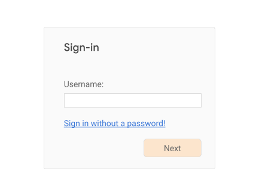

If the user clicks on “Sign in without a password\!”, with or without
having supplied a username, call `navigator.credentials.get()` without an
allow-list, making sure you require user verification:

```javascript
navigator.credentials.get({
  publicKey: {
    challenge: ...,
    rpId: ...,
    userVerification: "required", //!!!
  }
})
```

The result will include a credential id and user handle, which you can
use to figure out which user just authenticated. If the call fails, make
sure you give the user other options to sign into their account, such as
password-based flows or flows involving other types of login challenges.

## 6 Account Recovery / Device Loss

A concern around the use of FIDO authenticators is device loss: what
happens when a user loses their FIDO authenticator? How will they be
able to get back into (i.e., “recover”) their account? **Our general
recommendation is to encourage the user to register a *second*
authenticator as backup**, but there are a few caveats to consider:

  - If a user's *only* registered authenticator is a *platform*
    authenticator that is used ***only*** for
    [<span class="underline">FIDO-based
    reauthentication</span>](#performing-fido-based-reauthentication),
    then the user presumably has some other means to perform
    [<span class="underline">bootstrap
    sign-ins</span>](#bootstrapping-an-account). Thus, the user does
    not *necessarily* need to register a second authenticator, because
    the user will not be "locked out" of their account if they lose
    access to their platform authenticator. By definition, this
    "re-authentication-only" authenticator is used to simply bypass a
    different, more onerous login challenge (such as a password)
    during reauthentication - it **must** **not** be used for account
    bootstrap. Thus, the user will have other means to perform account
    bootstrap, and if needed, register a new platform authenticator
    for FIDO-based reauthentication.

  - If the user has roaming authenticators registered that are used
    during account bootstrap (e.g., as a 2nd factor, or as a UVRA for
    a *single-step account bootstrap*), there might still be other
    ways for the user to bootstrap their account on a new device. For
    example, the user might be a 2FA user that has both a security key
    and a HOTP-based 2nd-factor token registered for their account. If
    this is the case, the loss of the security key still doesn’t mean
    that the user will have lost access to their account. (Although
    this also means that the account isn’t getting full
    phishing-resistant protection.)

This leaves us with a scenario in which the user is a **“FIDO-only”
user**, meaning that they **must** use a roaming FIDO authenticator
during account bootstrap (either a UVRA, or a simpler authenticator
suitable as a second factor). In this case the relying party should
encourage the user to register a ***second*** **roaming (cross-platform)
authenticator**. *Do not* let the user register a platform authenticator
as a backup for a roaming authenticator (and, as we mentioned above,
don’t bother registering backups for platform authenticators that are
only used for re-authentication).

Allow the registration of the second (backup) authenticator to happen
over any authenticated user session: as we noted above, those sessions
by definition were bootstrapped by another FIDO authenticator, so the
security of the session is sufficient for this registration step.

## 7 Appendix: More Complex Use Cases

### 7.1 Phishing-Resistant Account Bootstrapping with Optional Passwordless Sign-In

So far we considered two different ways a relying party can achieve
phishing resistance for a user: either ask the user to register a simple
(not necessarily user-verifying) roaming authenticator that is then used
as a 2nd factor during account bootstrap, or ask the user to register a
UVRA, which provides two authentication factors and phishing resistance
in single-step account bootstrap flows.

What if the relying party is primarily interested in providing phishing
resistant account bootstrap flows to its users, but it wants to be
flexible as to whether this happens through a 2nd step (e.g., using a
non-user-verifying security key), or whether this happens through the
use of a UVRA and single-step account bootstrap? Webauthn
implementations compatible with Level 2 of the webauthn specification
can support such a scenario. As a result, the relying party can
customize the user experience to the individual user: if a user is in
possession of a simple (non-user-verifying) roaming authenticator, they
can use it to achieve a phishing-resistant account bootstrap, but will
have to also type a username and password. But if another user happens
to have a more advanced user-verifying roaming authenticator, they will
be able to skip the password (and potentially even the username) step
during account bootstrap.

The idea is that the relying party will create a credential on a roaming
authenticator, while being flexible as to whether that roaming
authenticator supports user verification and/or resident (aka
discoverable) credentials. If the authenticator supports user
verification, the user will be able to skip the password login challenge
during account bootstrap. If the authenticator also supports
resident/discoverable credentials, the user will in addition be able to
skip the identification step (typing the username, email address, or
other user identifier). If the authenticator supports neither, then the
user can **still use** the authenticator for a phishing-resistant
account bootstrap, but will have to pass additional login challenges
first (most likely username + password).

To achieve this, the relying party will not require user verification or
a resident/discoverable credential during credential creation. Instead,
you will set these to best-effort, or “preferred” mode (a feature only
available in Level 2 of the webauthn specification). Note that you also
need to set the [<span class="underline">credProps
extension</span>](https://www.w3.org/TR/webauthn-2/#sctn-authenticator-credential-properties-extension)
parameter to find out whether or not a resident/discoverable credential
was created.

```javascript
// Note that this example uses features only available 
// in Level 2 of the webauthn specification!
// ---------------------------------------------------

navigator.credentials.create({
  publicKey: {
    rp: {...},
    user: {...},
    challenge: ...,
    pubKeyCredParams: {
      type: "public-key",
      alg: -7
    },
    excludeCredentials: [{ //!!! other roaming authnrs already on
      type: "public-key",  //    file for this user
      id: new UInt8Array([21, 31, 56, ...]).buffer,
      transports: ["usb", "nfc"]
    }, {
      type: "public-key",
      id: new UInt8Array([21, 31, 56, ...]).buffer,
      transports: ["internal", "ble"]
    }, {
    ...
    }],
    authenticatorSelection: {
      authenticatorAttachment: "cross-platform", //!!! 
      residentKey: "preferred",                  //!!!
      userVerification: "preferred"              //!!!
    },
    extensions: {
      credProps: true,                           //!!!
    },
  }
})
```

> A note on attestation: We recommend that most relying parties not specify the attestation 
> conveyance parameter `attestation` ( thus defaulting to none), or instead explicitly use the 
> value `indirect`. This guarantees the most streamlined user experience (platforms are likely to 
> obtain consent from the user for other types of attestation conveyances, which likely results in 
> a larger fraction of unsuccessful credential creations due to users canceling the creation).

Depending on whether a resident/discoverable credential was in fact
created, and whether the authenticator response indicates support for
user verification, the relying party can afterwards let the user know
what experience they should expect during subsequent account bootstraps,
for example by telling them that they can use the “Sign in without a
password” feature mentioned in [<span class="underline">Signing in with
a UVRA</span>](#signing-in-with-a-uvra).

1.  I.e., without any saved user state or credentials, e.g., cookies or
    data in local storage containing (at least) the username or other
    information about the user. Typically, account bootstrapping results
    in the *creation* of saved user state on the user's device, enabling
    the user to later return via lower-friction flows.

2.  Not all FIDO authenticators are user verification-capable, though
    all FIDO authenticators are at least capable of *testing for user
    presence*. The latter is a means of sensing that a user is *at least
    physically present*. For example, the blinking button on many
    security keys is a user presence sensor. Touching it signals *a*
    user is present, but does not distinguish among individuals as user
    verification does. User presence testing is appropriate for
    *multi-step* account bootstrapping where users *explicitly* supply
    more than one authentication factor, e.g., their security key along
    with entering a password (i.e., "two-step verification"). However,
    user verification enables *single-step* account bootstrapping as
    well as single-gesture reauthentication, thus reducing user
    friction.

3.  “Single-step” here refers to the fact that the user has to pass only
    a single login challenge, not to the number of authentication
    factors. Single-step bootstrapping can be two-factor authentication,
    e.g., if the user has to confirm sign-in with their biometric
    (something they are) on their phone (something they have).

4.  This combination is mostly applicable in enterprises that require
    frequent malware-resistant credential refreshes, but is not covered
    in this guide.

5.  This use case is not covered in this guide.

6.  Although there are options to skip this step, which themselves use
    FIDO/webauthn APIs and UVRAs. We’ll discuss those
    [<span class="underline">below</span>](#signing-in-with-a-uvra).

7.  Although there are exceptions: for example, in an enterprise
    context, users may not be able to create accounts themselves, and
    instead need to rely on some other process to have the account
    created for them.

8.  We recommend that on this login challenge page, users can’t change
    their account identifier. Also, the login challenge should be
    something that an unauthorized user of the device can’t pass.

9.  Note that a relying party *may* choose to treat signing-out as a
    comprehensive action and thus delete all references to the user’s
    credential id (if it has any). Such a relying party ought to treat a
    subsequent sign-in like an account bootstrap, and repeat the steps
    explained above in [<span class="underline">Authenticating the
    User</span>](#authenticating-the-user) and
    [<span class="underline">Opting into FIDO-based
    Reauthentication</span>](#opting-into-fido-based-reauthentication)
    at the time of the next sign-in.

10. We’ll discuss the use of user-verifying roaming authenticators for
    single-step account bootstrapping below.

11. I.e., where all users need to register some form of 2nd factor
    during account creation or their first sign-in.

12. We do not recommend that relying parties require a second factor
    during reauthentication. Instead, you should see whether the user's
    platform features a user-verifying FIDO platform authenticator, and
    employ it, making reauthentication more user-friendly without
    sacrificing security.

13. There are ways to skip this step, which themselves use FIDO/webauthn
    APIs. We’ll discuss those
    [<span class="underline">below</span>](#signing-in-with-a-uvra).

14. Though, depending upon the type of authenticator, they may need to
    provide a PIN (which is locally processed by the platform OS and
    authenticator).

15. Historically, we used the term "resident key" to refer to what will
    be known as "discoverable credentials" in the upcoming WebAuthn L2
    and CTAP2.1 specs.

16. This limitation may be solved if CTAP is implemented on the platform 
    authenticators. CTAP will enable platform authenticators to securely connect
    to other devices via local transports like BLE and enable bootstrapping the 
    device. No off-the-shelf solution is available at the time of writing. 

17. Typically, in this scenario, password login needs to be enabled to avoid the
    ‘locked-out’ situation. Therefore, this model is vulnerable to phishing attacks 
    as passwords are allowed. On the other hand, if roaming authenticators are 
    registered in addition to the platform authenticator (instead of passwords), 
    it is phishing-resistant.

